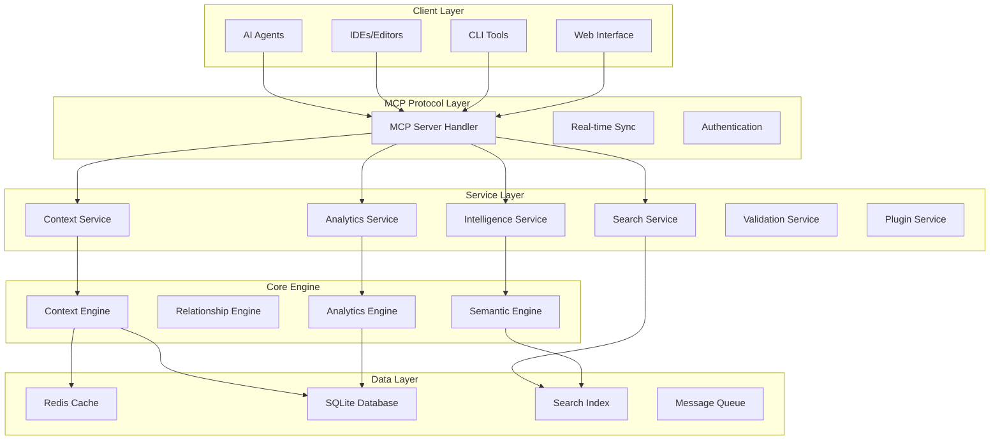
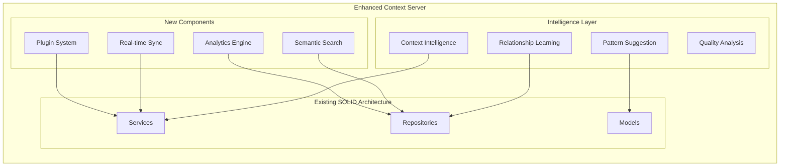

# Design Document

## Overview

This design transforms the existing MCP Context Server into a professional-grade context engine that AI agents will love to use. The enhanced system will provide intelligent context discovery, real-time synchronization, advanced analytics, and seamless integration with development workflows. The design maintains the existing SOLID architecture while adding sophisticated features for context intelligence, relationship management, and collaborative development.

## Architecture

### High-Level Architecture



### Enhanced Component Architecture



## Components and Interfaces

### 1. Enhanced Context Engine

**Core Interface:**
```rust
#[async_trait]
pub trait ContextEngine {
    async fn store_context(&self, context: ContextItem) -> Result<ContextId>;
    async fn query_context(&self, query: ContextQuery) -> Result<ContextResult>;
    async fn suggest_context(&self, partial_query: PartialQuery) -> Result<Vec<ContextSuggestion>>;
    async fn analyze_relationships(&self, context_id: ContextId) -> Result<RelationshipGraph>;
    async fn validate_context(&self, context: &ContextItem) -> Result<ValidationResult>;
}
```

**Implementation Features:**
- Intelligent context categorization and tagging
- Automatic relationship detection between context items
- Context quality scoring and improvement suggestions
- Semantic similarity analysis for better retrieval

### 2. Real-time Synchronization System

**Sync Interface:**
```rust
#[async_trait]
pub trait SyncEngine {
    async fn subscribe(&self, client_id: ClientId, filters: SyncFilters) -> Result<SyncStream>;
    async fn broadcast_change(&self, change: ContextChange) -> Result<()>;
    async fn handle_conflict(&self, conflict: SyncConflict) -> Result<Resolution>;
    async fn get_sync_status(&self, project_id: ProjectId) -> Result<SyncStatus>;
}
```

**Features:**
- WebSocket-based real-time updates
- Conflict resolution with merge strategies
- Offline synchronization with change queuing
- Multi-client state management

### 3. Semantic Search Engine

**Search Interface:**
```rust
#[async_trait]
pub trait SemanticSearch {
    async fn index_context(&self, context: &ContextItem) -> Result<()>;
    async fn search(&self, query: SearchQuery) -> Result<SearchResults>;
    async fn suggest_queries(&self, partial: &str) -> Result<Vec<QuerySuggestion>>;
    async fn find_similar(&self, context_id: ContextId) -> Result<Vec<SimilarContext>>;
}
```

**Implementation:**
- Vector embeddings for semantic understanding
- Full-text search with code-aware tokenization
- Natural language query processing
- Cross-project pattern recognition

### 4. Analytics and Intelligence Engine

**Analytics Interface:**
```rust
#[async_trait]
pub trait AnalyticsEngine {
    async fn track_usage(&self, event: UsageEvent) -> Result<()>;
    async fn generate_insights(&self, project_id: ProjectId) -> Result<ProjectInsights>;
    async fn predict_needs(&self, context: &CurrentContext) -> Result<Vec<Prediction>>;
    async fn quality_report(&self, timeframe: TimeRange) -> Result<QualityReport>;
}
```

**Features:**
- Context usage pattern analysis
- AI agent success rate tracking
- Context quality metrics and trends
- Predictive context suggestions

### 5. Plugin Architecture

**Plugin Interface:**
```rust
#[async_trait]
pub trait ContextPlugin {
    fn name(&self) -> &str;
    fn version(&self) -> &str;
    async fn initialize(&mut self, context: PluginContext) -> Result<()>;
    async fn handle_event(&self, event: ContextEvent) -> Result<PluginResponse>;
    async fn provide_context(&self, query: ContextQuery) -> Result<Option<ContextContribution>>;
}
```

**Built-in Plugins:**
- Git integration for tracking code changes
- Kiro specs integration for project management
- IDE integration for real-time code analysis
- Documentation generator for context summaries

## Data Models

### Enhanced Context Models

```rust
#[derive(Debug, Clone, Serialize, Deserialize)]
pub struct EnhancedContextItem {
    pub id: ContextId,
    pub project_id: ProjectId,
    pub content: ContextContent,
    pub metadata: ContextMetadata,
    pub relationships: Vec<ContextRelationship>,
    pub quality_score: f64,
    pub usage_stats: UsageStatistics,
    pub semantic_tags: Vec<SemanticTag>,
    pub created_at: DateTime<Utc>,
    pub updated_at: DateTime<Utc>,
    pub version: u32,
}

#[derive(Debug, Clone, Serialize, Deserialize)]
pub struct ContextRelationship {
    pub target_id: ContextId,
    pub relationship_type: RelationshipType,
    pub strength: f64,
    pub auto_detected: bool,
    pub created_at: DateTime<Utc>,
}

#[derive(Debug, Clone, Serialize, Deserialize)]
pub enum RelationshipType {
    DependsOn,
    Conflicts,
    Implements,
    Extends,
    References,
    Similar,
    Supersedes,
    Custom(String),
}

#[derive(Debug, Clone, Serialize, Deserialize)]
pub struct ContextMetadata {
    pub tags: Vec<String>,
    pub priority: Priority,
    pub confidence: f64,
    pub source: ContextSource,
    pub validation_status: ValidationStatus,
    pub last_accessed: Option<DateTime<Utc>>,
    pub access_count: u64,
}
```

### Project Specification Integration

```rust
#[derive(Debug, Clone, Serialize, Deserialize)]
pub struct ProjectSpecification {
    pub id: SpecId,
    pub project_id: ProjectId,
    pub spec_type: SpecType,
    pub title: String,
    pub content: SpecContent,
    pub requirements: Vec<Requirement>,
    pub tasks: Vec<Task>,
    pub status: SpecStatus,
    pub created_at: DateTime<Utc>,
    pub updated_at: DateTime<Utc>,
}

#[derive(Debug, Clone, Serialize, Deserialize)]
pub enum SpecType {
    Feature,
    Architecture,
    API,
    Database,
    Security,
    Performance,
    Custom(String),
}

#[derive(Debug, Clone, Serialize, Deserialize)]
pub struct Requirement {
    pub id: RequirementId,
    pub title: String,
    pub description: String,
    pub acceptance_criteria: Vec<AcceptanceCriterion>,
    pub priority: Priority,
    pub status: RequirementStatus,
    pub linked_tasks: Vec<TaskId>,
    pub linked_context: Vec<ContextId>,
}

#[derive(Debug, Clone, Serialize, Deserialize)]
pub struct Task {
    pub id: TaskId,
    pub title: String,
    pub description: String,
    pub status: TaskStatus,
    pub dependencies: Vec<TaskId>,
    pub estimated_effort: Option<Duration>,
    pub actual_effort: Option<Duration>,
    pub assigned_to: Option<String>,
    pub linked_requirements: Vec<RequirementId>,
    pub linked_context: Vec<ContextId>,
}
```

### Analytics Models

```rust
#[derive(Debug, Clone, Serialize, Deserialize)]
pub struct UsageStatistics {
    pub total_queries: u64,
    pub successful_queries: u64,
    pub last_query: Option<DateTime<Utc>>,
    pub average_relevance_score: f64,
    pub query_patterns: Vec<QueryPattern>,
}

#[derive(Debug, Clone, Serialize, Deserialize)]
pub struct ProjectInsights {
    pub project_id: ProjectId,
    pub context_health_score: f64,
    pub most_used_context: Vec<ContextUsage>,
    pub context_gaps: Vec<ContextGap>,
    pub quality_trends: QualityTrend,
    pub recommendations: Vec<Recommendation>,
}
```

## Error Handling

### Enhanced Error Types

```rust
#[derive(Debug, thiserror::Error)]
pub enum ContextEngineError {
    #[error("Context not found: {id}")]
    ContextNotFound { id: ContextId },
    
    #[error("Validation failed: {reason}")]
    ValidationError { reason: String },
    
    #[error("Sync conflict: {details}")]
    SyncConflict { details: String },
    
    #[error("Search index error: {source}")]
    SearchError { source: Box<dyn std::error::Error + Send + Sync> },
    
    #[error("Plugin error in {plugin}: {message}")]
    PluginError { plugin: String, message: String },
    
    #[error("Analytics error: {details}")]
    AnalyticsError { details: String },
    
    #[error("Database error: {source}")]
    DatabaseError { source: rusqlite::Error },
    
    #[error("Network error: {source}")]
    NetworkError { source: Box<dyn std::error::Error + Send + Sync> },
}
```

### Error Recovery Strategies

- **Graceful Degradation**: Core functionality continues even if advanced features fail
- **Retry Mechanisms**: Automatic retry with exponential backoff for transient failures
- **Fallback Options**: Alternative approaches when primary methods fail
- **Error Reporting**: Comprehensive error logging and user-friendly error messages

## Testing Strategy

### Unit Testing

```rust
#[cfg(test)]
mod tests {
    use super::*;
    use tokio_test;
    
    #[tokio::test]
    async fn test_context_intelligence() {
        let engine = create_test_context_engine().await;
        let context = create_test_context();
        
        let suggestions = engine.suggest_context(partial_query).await.unwrap();
        assert!(!suggestions.is_empty());
        assert!(suggestions[0].relevance_score > 0.8);
    }
    
    #[tokio::test]
    async fn test_real_time_sync() {
        let sync_engine = create_test_sync_engine().await;
        let client1 = sync_engine.subscribe(client_id_1, filters).await.unwrap();
        let client2 = sync_engine.subscribe(client_id_2, filters).await.unwrap();
        
        // Test change propagation
        sync_engine.broadcast_change(test_change).await.unwrap();
        
        // Verify both clients receive the change
        assert_eq!(client1.next().await.unwrap(), test_change);
        assert_eq!(client2.next().await.unwrap(), test_change);
    }
}
```

### Integration Testing

- **MCP Protocol Testing**: Verify all MCP tools work correctly with enhanced features
- **Database Integration**: Test complex queries and data consistency
- **Plugin System Testing**: Verify plugin loading, execution, and error handling
- **Performance Testing**: Load testing with large context datasets
- **Sync Testing**: Multi-client synchronization scenarios

### End-to-End Testing

- **AI Agent Workflows**: Complete workflows from context query to code generation
- **Multi-Project Scenarios**: Cross-project context sharing and management
- **Real-time Collaboration**: Multiple users working on the same project
- **Plugin Integration**: Third-party plugin compatibility and stability

## Implementation Phases

### Phase 1: Core Intelligence (4-6 weeks)
- Enhanced context engine with relationship detection
- Semantic search implementation
- Basic analytics and usage tracking
- Context validation and quality scoring

### Phase 2: Real-time Features (3-4 weeks)
- WebSocket-based synchronization
- Conflict resolution mechanisms
- Multi-client state management
- Offline synchronization support

### Phase 3: Advanced Analytics (3-4 weeks)
- Usage pattern analysis
- Predictive context suggestions
- Quality metrics and reporting
- Performance optimization

### Phase 4: Plugin Architecture (4-5 weeks)
- Plugin system framework
- Built-in plugins (Git, Kiro, IDE integration)
- Plugin marketplace infrastructure
- Documentation and examples

### Phase 5: Project Integration (2-3 weeks)
- Kiro specs integration
- Requirements and task management
- Cross-project context sharing
- Advanced project analytics

## Performance Considerations

### Scalability Targets
- **Response Time**: < 100ms for simple queries, < 500ms for complex semantic searches
- **Concurrent Users**: Support 100+ concurrent AI agents
- **Data Volume**: Handle projects with 10,000+ context items
- **Memory Usage**: < 512MB base memory footprint

### Optimization Strategies
- **Caching**: Redis-based caching for frequently accessed context
- **Indexing**: Optimized database indexes for common query patterns
- **Connection Pooling**: Efficient database connection management
- **Lazy Loading**: Load context relationships and metadata on demand
- **Background Processing**: Async processing for analytics and relationship detection

## Security Considerations

### Data Protection
- **Encryption**: All sensitive context data encrypted at rest and in transit
- **Access Control**: Role-based access control for different context types
- **Audit Logging**: Comprehensive audit trail for all context modifications
- **Data Isolation**: Project-level data isolation and access controls

### Plugin Security
- **Sandboxing**: Plugins run in isolated environments
- **Permission System**: Granular permissions for plugin capabilities
- **Code Signing**: Verified plugin signatures for trusted sources
- **Resource Limits**: CPU and memory limits for plugin execution

This design provides a comprehensive foundation for transforming the existing MCP Context Server into a professional-grade context engine that AI agents will love to use, while maintaining the solid architectural principles already established in the current system.